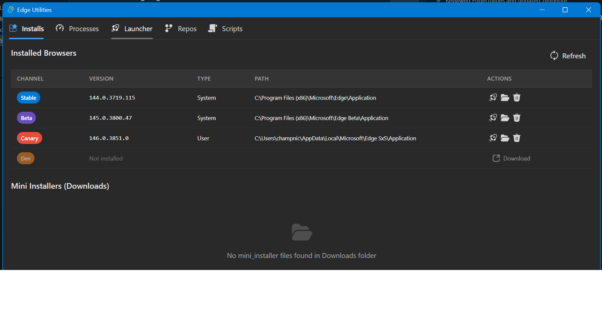

# Edge Utilities

A desktop application for Microsoft Edge browser developers, built with [Tauri 2](https://v2.tauri.app/) + React + TypeScript + [Fluent UI](https://react.fluentui.dev/). Provides a unified interface for managing Edge installs, monitoring processes, launching with flags, managing source repos, and running scripts.



## Features

### Installs Tab
- **Installed Browsers** — Lists all installed Edge channels (Stable, Beta, Dev, Canary) with version, install type (System/User), and path
- **Quick Actions** — Launch, open install folder, or uninstall any channel
- **Download** — Direct download link for channels not yet installed
- **Mini Installers** — Scans your Downloads folder for `mini_installer` files and lets you install them with a specific channel flag

### Processes Tab
- **Live Process Tree** — Groups all running Edge processes by their root browser process with parent PID tree traversal
- **Channel & Instance Detection** — Identifies Stable, Beta, Dev, Canary, WebView2, and Copilot instances with color-coded badges
- **WebView2 Host App** — Shows the hosting application name for WebView2 groups
- **Process Type Sorting** — Processes sorted by type: Browser → Renderer → Extension → GPU → Crashpad → Utility
- **Auto-Refresh** — Toggle auto-refresh (persisted to localStorage) with 5-second interval
- **Channel Filters** — Toggle visibility of each channel/instance type (persisted, WebView2 hidden by default)
- **Actions** — Terminate or debug (attach debugger) any process. Debug tries WinDbg Preview → WinDbg → VS JIT Debugger

### Launcher Tab
- **Launch Edge** — Start any installed Edge channel with custom command-line flags
- **Common Flags** — Quick-add common flags like `--user-data-dir`, `--disable-extensions`, etc.
- **Presets** — Save and load flag presets for repeated use
- **Temp User Data Dir** — One-click creation of a temporary user data directory

### Repos Tab
- **Multi-Repo Management** — Add and manage multiple Edge/Chromium source repositories
- **Drag Reorder** — Reorder repos via drag handle (pointer events for WebView2 compatibility)
- **Lazy Loading** — Shows branch on collapse, loads full info (out dirs, commits) on expand
- **Build Targets** — Build common targets (`chrome`, `mini_installer`, unit tests, etc.) via `autoninja`
- **Autogn Configs** — Create new out directories with a dropdown of pre-populated autogn configurations (Developer, Sanitizer, Official builds)
- **Edge Dev Environment** — Open an Edge dev environment terminal (`initEdgeEnv.cmd`)
- **Gclient Sync** — Run `gclient sync -f -D` in a new console window
- **Recent Commits** — View the last 15 commits for each repo

### Scripts Tab
- **Custom Scripts** — Define and run custom scripts or workflows
- **Persistence** — Scripts are saved and restored across sessions

## Prerequisites

- **Node.js** 18+ and npm
- **Rust** 1.70+ with the MSVC toolchain
  - If Rust is installed to a non-default location, you'll need to add it to your PATH before building
- **Windows 10/11** — The app uses Windows-specific APIs (registry, process management)
- **WebView2 Runtime** — Required by Tauri 2 (pre-installed on Windows 10 1803+ and Windows 11)

## Building & Running

### Development Mode

```powershell
# If Rust is at the default location (~/.cargo/bin), just run:
npm install
npm run tauri dev

# If Rust is installed to a custom location, prepend it to PATH first:
$env:PATH = "C:\Program Files\Rust stable MSVC 1.93\bin;$env:PATH"
npm run tauri dev
```

This starts Vite on `http://localhost:1420` with hot-reload for the frontend. Rust backend changes trigger an automatic recompile.

### Production Build

```powershell
npm run tauri build
```

Produces:
- Executable: `src-tauri/target/release/edge-utilities.exe`
- MSI installer: `src-tauri/target/release/bundle/msi/`
- NSIS installer: `src-tauri/target/release/bundle/nsis/`

### Common Issues

| Issue | Fix |
|-------|-----|
| `localhost refused to connect` | Use `npm run tauri dev`, not `cargo build` alone |
| Port 1420 already in use | `Get-NetTCPConnection -LocalPort 1420 \| ForEach-Object { Stop-Process -Id $_.OwningProcess -Force }` |
| `cargo` not found | Add Rust bin directory to PATH (see above) |

## Project Structure

```
EdgeUtilities/
├── src/                          # React frontend
│   ├── App.tsx                   # Main app with FluentProvider + tab navigation
│   ├── App.css                   # Global styles
│   └── tabs/
│       ├── InstallsTab.tsx       # Edge install management
│       ├── ProcessesTab.tsx      # Process monitoring & debugging
│       ├── LauncherTab.tsx       # Edge launcher with flags
│       ├── ReposTab.tsx          # Source repo management & builds
│       └── ScriptsTab.tsx        # Custom script runner
├── src-tauri/                    # Rust backend
│   ├── Cargo.toml                # Rust dependencies
│   ├── tauri.conf.json           # Tauri configuration
│   ├── capabilities/             # Tauri security permissions
│   └── src/
│       ├── lib.rs                # Tauri entry point & command registration
│       └── commands/
│           ├── installs.rs       # Registry scanning, install/uninstall
│           ├── processes.rs      # sysinfo process enumeration, debugging
│           ├── launcher.rs       # Edge launching, flag presets
│           ├── repos.rs          # Git operations, autogn, builds
│           └── scripts.rs        # Script persistence & execution
├── index.html
├── package.json
├── vite.config.ts
└── tsconfig.json
```

## Tech Stack

| Layer | Technology |
|-------|-----------|
| Framework | [Tauri 2.x](https://v2.tauri.app/) |
| Frontend | React 19, TypeScript, Vite 7 |
| UI Components | [Fluent UI React v9](https://react.fluentui.dev/) |
| Backend | Rust with Tokio |
| Process Info | [sysinfo](https://crates.io/crates/sysinfo) 0.33 |
| Registry | [winreg](https://crates.io/crates/winreg) 0.55 |
| Windows APIs | [windows](https://crates.io/crates/windows) 0.58 |

## Contributing

1. **Fork & Clone** the repository
2. **Create a feature branch**: `git checkout -b feature/my-feature`
3. **Install dependencies**: `npm install`
4. **Run in dev mode**: `npm run tauri dev`
5. **Make changes** — frontend changes hot-reload, Rust changes auto-recompile
6. **Type-check**: `npx tsc --noEmit`
7. **Test a production build**: `npm run tauri build`
8. **Submit a Pull Request**

### Adding a New Tab

1. Create `src/tabs/MyTab.tsx` with a default export React component
2. Add the corresponding Rust commands in `src-tauri/src/commands/mytab.rs`
3. Register the module in `src-tauri/src/commands/mod.rs`
4. Register commands in `src-tauri/src/lib.rs` via `.invoke_handler(tauri::generate_handler![...])`
5. Add the tab to the `TabList` in `src/App.tsx`

### Code Conventions

- **Rust**: Use `#[tauri::command]` for all IPC functions. Return `Result<T, String>` for error handling.
- **TypeScript**: Use `invoke<T>()` from `@tauri-apps/api/core` to call Rust commands.
- **Styling**: Use CSS variables from `App.css` for theming. The app uses Fluent UI's `webDarkTheme`.
- **Persistence**: Use `localStorage` for UI state (filters, toggles). Use JSON files in the app directory for data (repo lists, presets, scripts).
